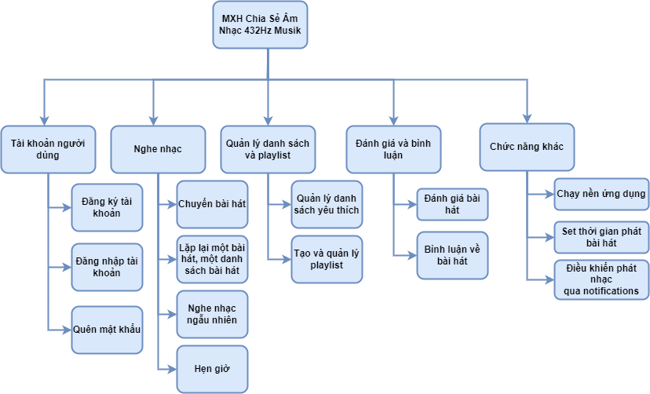
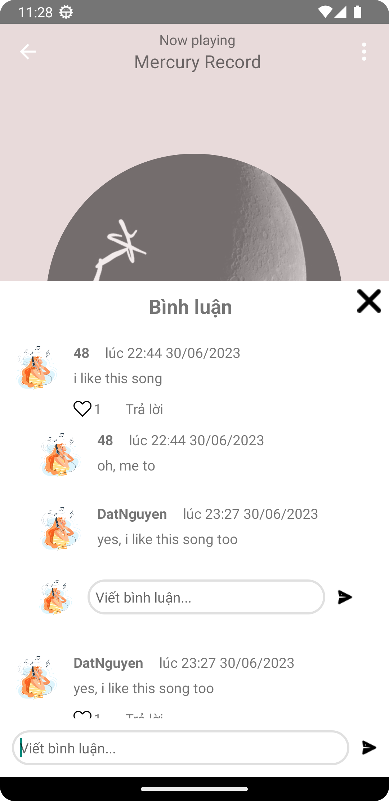

<h1 align="center">ĐỒ ÁN MÔN PHÁT TRIỂN ỨNG DỤNG TRÊN THIẾT BỊ DI ĐỘNG
</h1>
<h1 align="center">
NT118.N12
</h1>

## NHÓM SINH VIÊN THỰC HIỆN

<table class="tg">
<thead>
  <tr>
    <th class="tg-7btt">STT</th>
    <th class="tg-7btt">HỌ TÊN</th>
    <th class="tg-7btt">HỌ TÊN SINH VIÊN</th>
  </tr>
</thead>
<tbody>
  <tr>
    <td class="tg-7btt">1</td>
    <td class="tg-0pky">Trần Quốc Khánh</td>
    <td class="tg-c3ow">20520578</td>
  </tr>
  <tr>
    <td class="tg-7btt">2</td>
    <td class="tg-0pky">Nguyễn Đạt</td>
    <td class="tg-c3ow">20520434</td>
  </tr>
  <tr>
    <td class="tg-7btt">3</td>
    <td class="tg-0pky">Nguyễn Minh Cường</td>
    <td class="tg-c3ow">20520422</td>
  </tr>
</tbody>
</table>

## Giới thiệu

- Project này là dự án được thiết kế và thực hiện để phục vụ Đồ án môn Phát triển ứng dụng trên thiết bị di động với đề tài Xây dựng Mạng Xã Hội chia sẽ âm nhạc 432Hz Musik. Thông qua project này các thành viên học các quản lý thời gian, quản lý công việc và hoàn thiện

- Công nghệ và thư viện sử dụng: Kotlin, Firebase, Android Studio,... 

## Chức năng
1. Đăng ký tài khoản
2. Đăng nhập tài khoản
3. Quên mật khẩu
4. Thêm xoá sửa playlist
5. Thích bài hát
6. Bình luận, trả lời bình luận
7. Tìm kiếm
8. Phát nhạc được lưu trong thiết bị
9. Điều khiển bài hát thông qua notifications
10. Phát nhạc ngầm
11. Cài đặt thời gian phát nhạc

## Sơ đồ phân ra chức năng và hình ảnh minh hoạ

Sơ đồ phân rã chức năng

  
   
  <em>Sơ đồ phân rã chức năng</em>

Một số màn hình giao diện ứng dụng

  
   
  <em>Màn hình giao diện đăng ký</em>

  
   
  <em>Giao diện màn hình đăng nhập</em>

  
   
  <em>Giao diện màn hình trang chủ</em>

  
   
  <em>Giao diện màn hình phát nhạc</em>

  
   
  <em>Giao diện màn hình bình luận</em>

  
   
  <em>Giao diện màn hình danh sách playlist</em>

## Cài đặt và hướng dẫn sử dụng:
- Clone github từ link: https://github.com/minhcuong115uit/muzik.git
- Khởi chạy bằng ứng dụng Android Studio.

